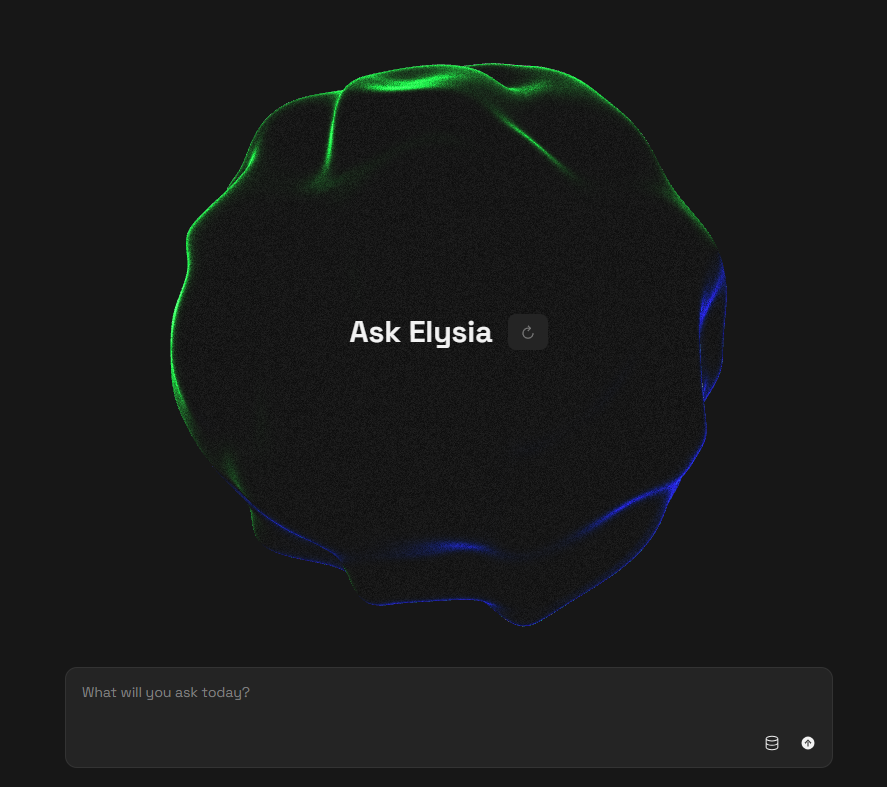

# Elysia: An Agentic RAG App


Elysia is an agentic Retrieval-Augmented Generation (RAG) application designed to enhance the capabilities of AI models by integrating them with external knowledge bases. This application leverages the power of Weaviate, a vector search engine, to provide contextually relevant information to AI models, thereby improving their performance in tasks requiring external knowledge.

## Getting Started

### Prerequisites

Ensure you have the following installed:

- Python 3.12
- pip (Python package manager)

### Installation

1. Clone the repository:

   ```bash
   git clone https://github.com/edcalderin/elysia-agentic-rag-app.git
   cd elysia-agentic-rag-app
   ```
2. Create and activate a conda environment:

   ```bash
   conda create --name elysia-env python=3.12
   conda activate elysia-env
   ```
3. Install the required packages:

   ```bash
   pip install -r requirements.txt
   ```
4. Set up your environment variables. Create a `.env` file in the root directory and add your Weaviate credentials (ie. `.env.example`):

   ```
   WEAVIATE_URL=
   WEAVIATE_API_KEY=
   OPENAI_API_KEY=
   ```

### Usage

Run the Elysia application:

```bash
   elysia start
```

## Acknowledgments

- Thanks to the developers of Weaviate for providing a powerful vector search engine.
